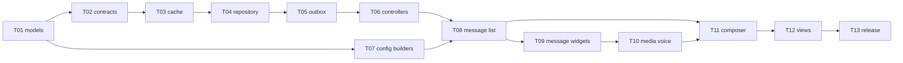

# Tasks

Build **one task per session**. Each file is self-contained: Goal, Read first, Depends on, Deliverables, Public API, Done when, Do not. When a task lands: export its public files from `lib/flutter_chat_kit.dart`, tick its boxes, set its status here, and add a line to `CHANGELOG.md` under `## [Unreleased]`.

| ID | Goal | Depends on | Status |
| --- | --- | --- | --- |
| T00 | Package skeleton, spec, task files | — | Done |
| [T01](T01-models.md) | Immutable models + JSON codec | T00 | Done |
| [T02](T02-contracts-chat-kit.md) | `ChatSource` / `ChatUploader` / `ChatUserResolver`, `ChatKit` root, `ChatKitScope`, import guard | T01 | Done |
| [T03](T03-drift-cache.md) | Drift cache: tables, DAOs, watch queries, per-user DB | T02 | Done |
| [T04](T04-repository-sync.md) | `ChatRepository`: cache-first, gap fill, keyset paging, fetchAround, realtime | T03 | Done |
| [T05](T05-outbox.md) | `Outbox`: optimistic send, upload progress, retry, failed, reconcile | T04 | Done |
| [T06](T06-controllers.md) | `InboxController`, `ChatRoomController`, `ComposerController` | T05 | Done |
| [T07](T07-theme-config-builders.md) | `ChatTheme`, `ChatConfig`, `ChatStrings`, `ChatFormatters`, builders, `MessageContext` | T01 | Done |
| [T08](T08-message-list-scroll.md) | `ChatMessageList` scroll engine | T06, T07 | Done |
| [T09](T09-message-widgets.md) | Bubble, text, file, system, ticks, reply, reactions, actions | T08 | Done |
| [T10](T10-media-voice.md) | Images, gallery, video, audio player hub, voice recorder controller | T09 | Done |
| [T11](T11-composer.md) | `ChatComposer`, attachment sheet, voice record button, reply/edit banner | T08, T10 | Done |
| [T12](T12-views.md) | `ChatAppBar`, `ChatRoomView`, `InboxView`, `RoomTile`, search | T11 | Done |
| [T13](T13-example-docs-release.md) | Example app, adapter guides, README, SKILL.md, 0.1.0 | T12 | Done (publish pending owner) |

T07 can run in parallel with T02–T06.

## Reference code (read, do not copy blindly)

| Topic | Path | Keep | Avoid |
| --- | --- | --- | --- |
| Reversed list, preload, jump + highlight | `valizex/valizex/lib/pages/chat_page.dart`, `contact_chat_page.dart` | index-0-newest, `ItemPositionsListener` logic, load-until-found jump | forced scroll on every message, `Map` messages, 3000-line page |
| Optimistic media send | `valizex/valizex/lib/pages/contact_chat_page.dart` (`_uploadImage`) | `localId` reconciliation, progress map | placeholder rows that never reach SQLite |
| Voice recorder UX | `valizex/valizex/lib/widgets/VoiceRecordingDialog.dart` | idle → recording → review, swipe-to-cancel, <1 s discard | fake waveform (use real amplitude) |
| Voice player | `valizex/valizex/lib/widgets/AudioMessageBubble.dart` | waveform bars, seek on tap | hard-coded pixel offsets, one player per bubble |
| Lazy image + gallery | `valizex/valizex/lib/widgets/LazyChatImage.dart`, `ConversationMediaGallery.dart` | cache-first, DPR mem cache, Hero, PageView + zoom | recomputing the gallery list per bubble |
| Idempotent send, dedup | `lightnessword/lib/features/chat/providers/state/dmChat_state_provider.dart` | client UUID as server id | offset-growing pagination, no failed state |
| Conversation rows per member | `lightnessword/migrations/chat_migration/*.sql` | `store_message` RPC, mirrored conversations, unread count | — |

Both apps live under `C:\Users\lemsa\Documents\apps\`.
